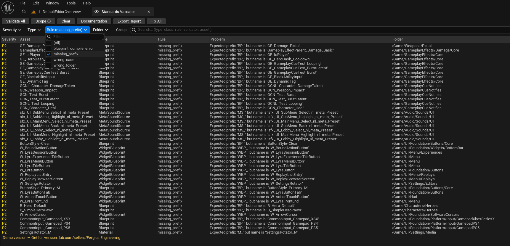

# Asset Standards Validator — Demo

Validates and enforces asset naming, folder structure, and quality standards inside Unreal Engine 5. Catches bad assets before they reach the project or the pipeline.

Inspired by [Allar's UE5 Style Guide](https://github.com/Allar/ue5-style-guide).

---




---

## Quick start

1. Open the plugin panel: **Tools → Asset Standards Validator → Open ASV Panel**
2. Click **Run Full Audit** in the toolbar
3. Wait for scan to finish — results appear in the panel
4. Click any result to select the asset in the Content Browser
5. Click **Auto-fix** on a result (or right-click → Fix) to apply the fix


---

## What it checks

Six validator categories, all configurable. Most rules are off by default on first run — they're noisy on legacy projects. Enable progressively as your team's standards solidify.

| Category | Checks | Auto-fix |
|----------|--------|----------|
| **Naming Convention** | Prefix, suffix, junk names, non-ASCII | ✅ Rename |
| **Folder Structure** | Wrong location, bad path format, Developers/ check | ✅ Move |
| **Texture** | Power-of-two, max size, sRGB, compression, LOD group | ✅ Set property |
| **Blueprint** | Variable naming, bool prefix, tooltips, compilation errors | ✅ Rename var |
| **Static Mesh** | Collision, LODs, Nanite policy | ✅ Nanite only |
| **Asset Health** | Stale redirectors | ✅ Consolidate |

<details>
<summary>Full rule reference (all rule IDs, defaults, config properties)</summary>

### Naming Convention

| Rule ID | What it checks | On by default |
|---------|---------------|:-------------:|
| `missing_prefix` | Asset has required class prefix (e.g. `BP_`, `T_`) | ✅ |
| `duplicate_prefix` | Prefix is not repeated in the name | ✅ |
| `missing_suffix` | Asset has required class suffix when defined | ✅ |
| `missing_allowed_suffix` | World assets use allowed level suffixes | ✅ |
| `name_pattern_mismatch` | Name matches the allowed pattern regex | ❌ |
| `non_ascii_name` | No non-ASCII characters in name | ❌ |
| `junk_name` | Name is not a placeholder (New, Temp, Default…) | ❌ |

Auto-fix: `missing_prefix`, `duplicate_prefix`, `missing_suffix`, `missing_allowed_suffix`, `junk_name`.

### Folder Structure

| Rule ID | What it checks | On by default |
|---------|---------------|:-------------:|
| `wrong_folder` | Asset is in the correct folder for its class | ✅ |
| `folder_not_pascal_case` | Each folder segment uses PascalCase | ❌ |
| `folder_contains_unicode` | No non-ASCII characters in folder path | ✅ |
| `folder_disallowed_name` | No generic folder names (Assets, Meshes…) | ❌ |
| `folder_in_developers` | Asset is not inside the Developers/ folder | ✅ |

Auto-fix: `wrong_folder` (moves asset to the correct folder).

### Texture

Reads from asset metadata — no full load required.

| Rule ID | What it checks | On by default |
|---------|---------------|:-------------:|
| `texture_not_power_of_two` | Width and height are both powers of two | ❌ |
| `texture_exceeds_max_size` | Dimensions within max size (default 8192) | ✅ |
| `texture_wrong_srgb` | sRGB flag matches texture type | ❌ |
| `texture_wrong_compression` | Compression matches texture type | ❌ |
| `texture_wrong_group` | LOD group matches texture suffix | ❌ |

Detection is based on name suffix: `_D` → color (sRGB on), `_N` → normal (sRGB off), etc.

Auto-fix: `texture_wrong_srgb`, `texture_wrong_compression`, `texture_wrong_group`.

### Blueprint

| Rule ID | What it checks | On by default |
|---------|---------------|:-------------:|
| `bp_bool_no_prefix` | Boolean variables start with `b` | ❌ |
| `bp_bool_is_pattern` | Avoid `bIsDead` — prefer `bDead` | ❌ |
| `bp_var_not_pascal_case` | Variable uses PascalCase | ❌ |
| `bp_var_atomic_type_name` | Name does not include type (`Score` not `ScoreInt`) | ❌ |
| `bp_editable_missing_tooltip` | Editable variables have tooltip text | ❌ |
| `bp_var_config_flag` | Variable does not use the Config flag | ❌ |
| `bp_editable_missing_range` | Editable numeric variables have a range set | ❌ |
| `bp_vars_uncategorized` | Editable variables are categorized (when ≥ 5) | ❌ |
| `bp_var_redundant_context` | Variable name doesn't repeat the class name | ❌ |
| `var_array_not_plural` | Array variables use plural names | ❌ |
| `var_missing_type_name` | Struct/object variables include type name | ❌ |
| `blueprint_compile_error` | Blueprint has no compilation errors | ✅ |
| `blueprint_compile_warning` | Blueprint has no compilation warnings | ✅ |
| `blueprint_needs_compile` | Blueprint is up to date (not dirty) | ✅ |

Auto-fix: `bp_bool_no_prefix`, `bp_bool_is_pattern`, `bp_var_not_pascal_case`.

### Static Mesh

| Rule ID | What it checks | On by default |
|---------|---------------|:-------------:|
| `mesh_no_collision` | Mesh has collision geometry | ❌ |
| `mesh_no_lods` | Mesh has LODs (for meshes over 5 000 triangles) | ❌ |
| `mesh_nanite_policy` | Nanite is enabled/disabled as required | ❌ |

Auto-fix: `mesh_nanite_policy` (enables or disables Nanite per policy).

### Asset Health

| Rule ID | What it checks | On by default |
|---------|---------------|:-------------:|
| `stale_redirector` | ObjectRedirector has been resolved | ✅ |

Auto-fix: consolidates the redirector.

</details>

---

## Validation triggers

ASV validates in the background — you don't have to remember to run scans manually.

Three triggers are **on by default** with the auto-created config:

| Trigger | When it fires |
|---------|--------------|
| **OnSave** | Validates assets as they're saved |
| **OnAssetCreated** | Validates a new asset the moment it's created |
| **OnAssetRenamed** | Re-validates an asset after rename |

Two more triggers are available and **off by default** (opt-in in the config DataAsset):

| Trigger | When it fires |
|---------|--------------|
| **OnStartup** | Full scan of all assets when the editor opens |
| **OnPIE** | Validates open assets before Play In Editor starts |

Overlay badges in the Content Browser update as violations are detected — no panel required.


---

## Batch Fix

Fix an entire filtered rule at once — no need to click through each asset individually.

**Flow:**
1. Run a full audit and wait for results
2. Use the **Rule** filter dropdown to narrow results to a single rule (e.g. `missing_prefix`)
3. The **Fix All** button in the toolbar activates when 2–200 fixable results are visible
4. Click **Fix All** — a dialog opens showing all assets grouped by folder
5. Each row shows the current name and the **proposed name after fix** — edit the proposed name inline if needed
6. Conflicting assets (two assets that would get the same name, or a target path already occupied) are flagged ⚠ before anything is applied
7. Uncheck any assets you want to skip, then click **Fix Selected** — progress updates per row in real time
8. When done, the panel refreshes and a summary toast appears


> Demo allows up to 5 batch fix uses per editor session. The button shows remaining uses in the tooltip. Resets on editor restart.

---

## Audit Report

Export a full report after any scan: **Export Report → HTML / JSON / CSV**.

The HTML report opens in your browser — health score, top violations by impact, breakdown by folder and rule.


---

## CI Integration *(full version)*

The full version includes a commandlet for unattended validation in CI pipelines.

```
UnrealEditor-Cmd.exe MyProject.uproject -run=ASVCommandlet \
  -Root=/Game/Art,/Game/Blueprints \
  -severity=P1 \
  -format=json \
  -output=./reports/
```

**Exit codes:** `0` = no violations at the specified severity, `1` = violations found, `2` = report write error.

**Severity threshold:** `-severity P0` (default) fails only on critical issues; `-severity P1` fails on warnings too. P0–P3 available.

**Scoping:** `-Root` accepts comma-separated content paths; `-MaxAssets` caps the scan for incremental runs.

JSON output includes per-rule counts and asset paths — plug directly into CI dashboards or PR gates.

> The commandlet is disabled in the demo and exits with an error.

---

## Configuration

On first run the plugin creates a config DataAsset automatically: **`Content/Data/DA_ASV_AllarStyleGuide`**. Open it to enable or adjust checks — no setup required to get started.

**Project Settings → Plugins → Asset Standards Validator** — global settings: scan roots, exclude paths, logging.


**Custom class prefixes** — for project-specific asset types (e.g. `GA_` for Gameplay Abilities): open the DataAsset, expand **ASVValidator_NamingConvention → Class Rules**, add an entry with the parent class and prefix. Blueprint subclasses match automatically.

Full configuration reference is in the [in-editor documentation](#in-editor-documentation).

---

## In-editor documentation

Full reference is available inside the editor: **Tools → Asset Standards Validator → Documentation**. Works offline, searchable, covers all validators, auto-fix, configuration, and reports.


---

## Demo vs Full

| Feature | Demo | Full |
|---------|------|------|
| All validators | ✅ | ✅ |
| All triggers | ✅ | ✅ |
| Auto-fix (single asset) | ✅ | ✅ |
| Report export (HTML/JSON/CSV) | ✅ | ✅ |
| In-editor docs | ✅ | ✅ |
| Batch fix | ⚠️ 5 uses/session | ✅ Unlimited |
| Batch scan | ⚠️ 200 assets/run | ✅ Unlimited |
| CI commandlet | ❌ | ✅ |
| Custom validators (C++/BP) | ❌ | ✅ |
| Source code | ❌ | ✅ |
| Platforms | Windows only | Windows · Linux · Mac |

---

## ⚠️ Demo limitations

- **Scans up to 200 assets per run** — the most recently modified assets in scope. A pre-scan toast tells you when the cap is applied. Single-asset validation (right-click → Validate) has no cap.
- **Batch Fix is limited to 5 uses per editor session** — resets on restart. Fixing one asset at a time is unlimited.
- **CI commandlet is disabled** — `ASVCommandlet` exits with an error in demo builds.
- **No source code** — custom validators (C++/Blueprint) require the full version.
- **Windows only** — full version supports Windows, Linux, and Mac.

---

## Install

1. Go to [**Releases**](https://github.com/Fergius-Engineering/AssetStandardsValidatorDemo/releases) and download the zip for your UE version: `AssetStandardsValidator_Demo_{ue}_{ver}.zip`
2. Extract the zip — you'll get an `AssetStandardsValidator` folder
3. Copy it to `UE_5.x/Engine/Plugins/Marketplace/AssetStandardsValidator/`
4. Open your project, go to **Edit → Plugins**, search for **Asset Standards Validator**, enable it, and restart the editor

> **UE versions:** 5.0 · 5.1 · 5.2 · 5.3 · 5.4 · 5.5 · 5.6 · 5.7  
> **Editor-only plugin.** Not included in packaged builds.

---

## Get full version

[**Asset Standards Validator on Fab →**](https://www.fab.com/sellers/Fergius%20Engineering)

Full version includes unlimited scanning, CI integration, source code, and the ability to write custom validators in C++ or Blueprint.

> **Before installing the full version:** remove the demo plugin first. Both versions share the same module name and will conflict if installed together. Delete or rename the `AssetStandardsValidator` folder in your engine's `Plugins/Marketplace/` directory, then restart the editor before installing the full version.

---

## Bugs and questions

[Open an issue →](https://github.com/Fergius-Engineering/AssetStandardsValidatorDemo/issues)

Please include your UE version and a brief description of what happened.
