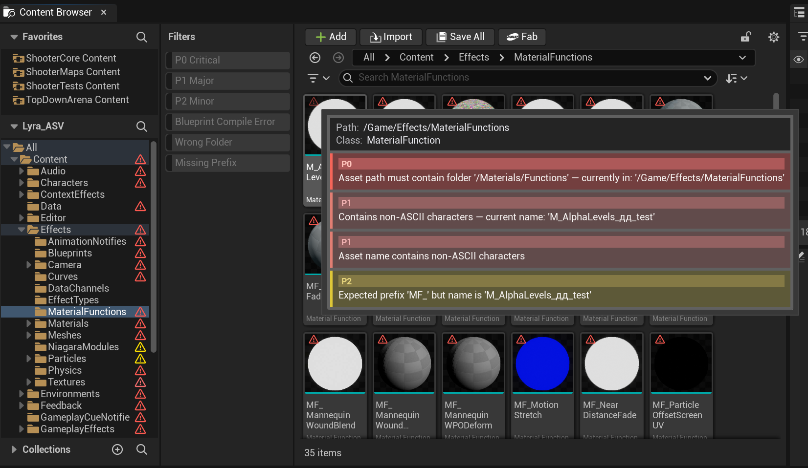
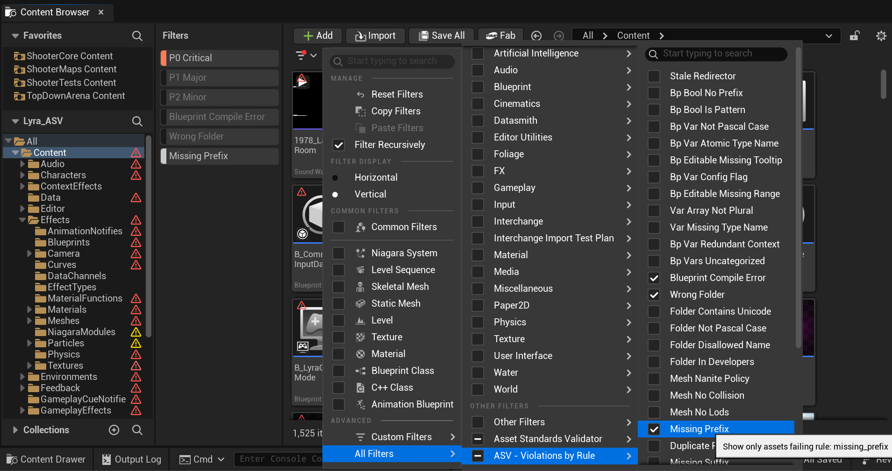
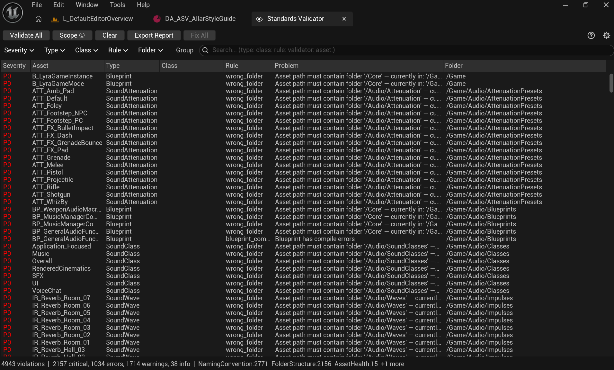
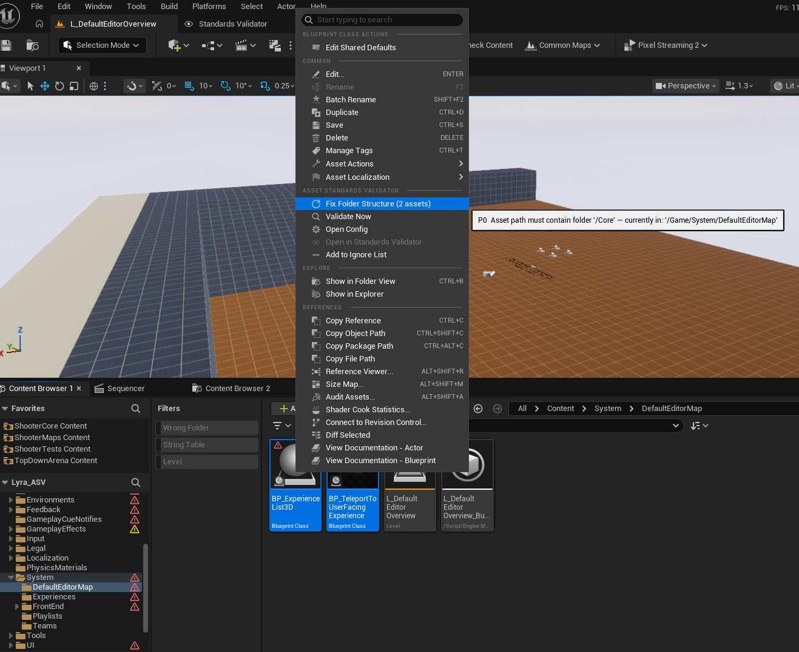
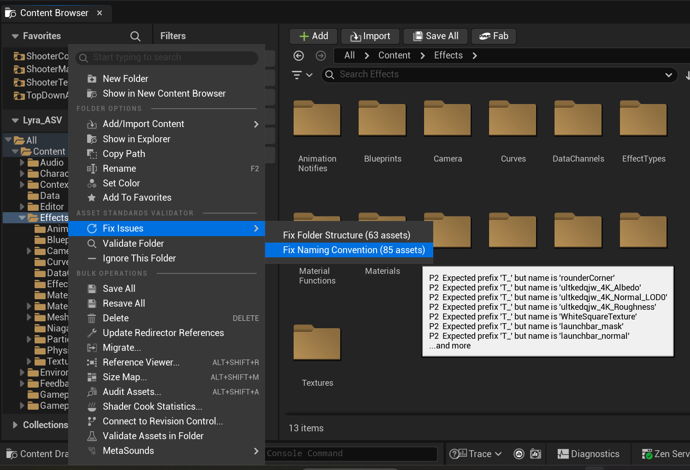
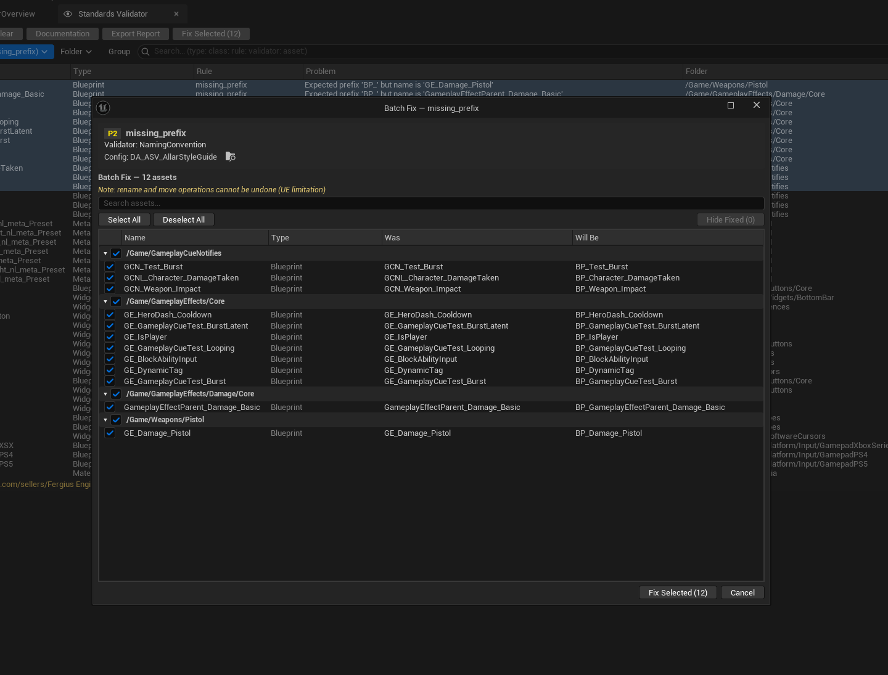
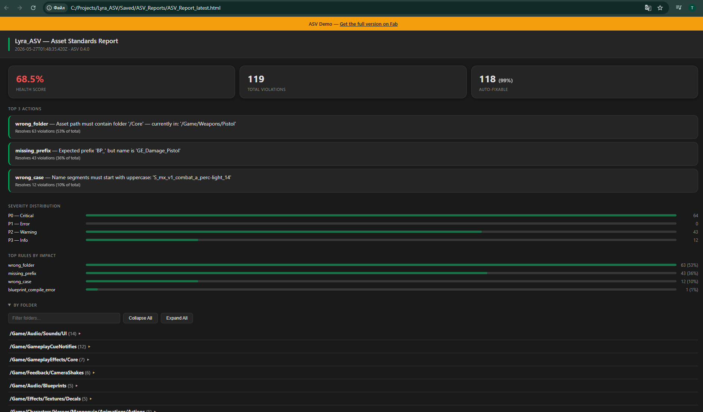
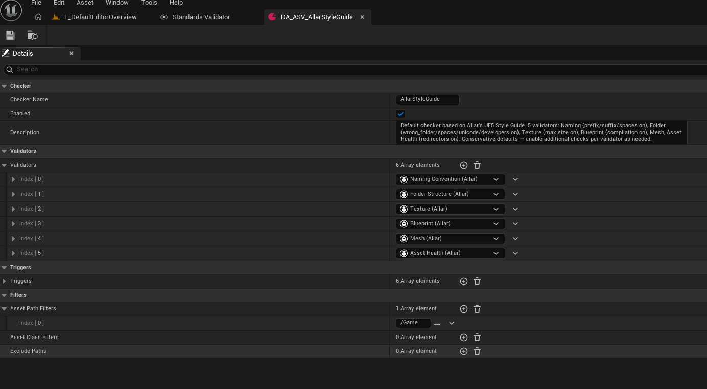
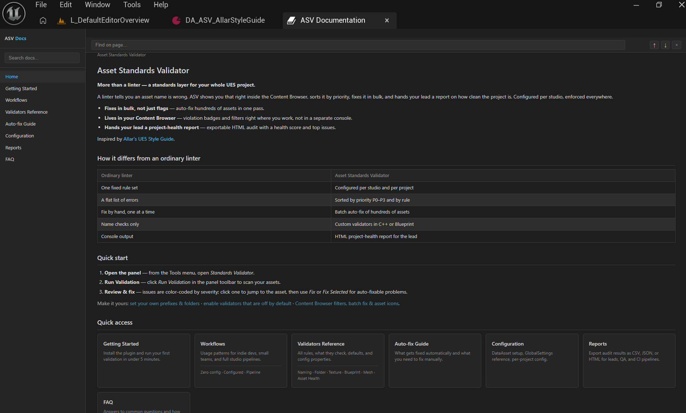

# Asset Standards Validator — Demo

**More than a linter — a standards layer for your whole UE5 project.**

A linter tells you an asset name is wrong. ASV shows you that right inside the Content Browser, sorts it by priority, fixes it in bulk, and hands your lead a report on how clean the project is. Configured per studio, enforced everywhere.

[](https://github.com/Fergius-Engineering/AssetStandardsValidatorDemo/releases)
[](https://www.fab.com/sellers/Fergius%20Engineering)
[](#install)

> **⬇ Where to download:** open the [**Releases**](https://github.com/Fergius-Engineering/AssetStandardsValidatorDemo/releases) page and grab `AssetStandardsValidator_Demo_{ue}_{ver}.zip` for your UE version. Full install steps are [below](#install).



- **Fixes in bulk, not just flags** — auto-fix hundreds of assets in one pass, with a per-row review before anything is applied.
- **Lives in your Content Browser** — violation badges and filters right where you work, not in a separate console.
- **Hands your lead a project-health report** — exportable HTML audit with a health score and top issues.

---

## More than a linter

| Ordinary linter | Asset Standards Validator |
|-----------------|---------------------------|
| One fixed rule set | Configured per studio and per project |
| A flat list of errors | Sorted by priority P0–P3 and by rule |
| Fix by hand, one at a time | Batch auto-fix of hundreds of assets |
| Name checks only | Custom validators in C++ *(full version)* |
| Console output | HTML project-health report for the lead |

---

## Two ways to work: panel or Content Browser

You don't have to live in the ASV panel. Every violation is visible — and fixable — right in the Content Browser.

- **Badges on assets and folders** — a marker appears on any asset that fails a check, and on every folder that contains one. Hover an asset to see the exact violations and their severity.
- **Native filter dropdown** — open the Content Browser filter menu and you'll find an **Asset Standards Validator** section: filter by severity (P0–P3), by "Has Any Error", or by a specific rule. Narrow thousands of assets down to just the broken ones in two clicks.
- **Right-click → Validate / Fix** — validate or auto-fix a single asset, or a whole folder, straight from the context menu.

The panel gives you the full sortable list, batch fixes, and reports. The Content Browser gives you the same violations inline, while you work. Use whichever fits the moment.





---

## Quick start

1. Open the plugin panel: **Tools → Asset Standards Validator → Open ASV Panel**
2. Click **Run Full Audit** in the toolbar
3. Wait for scan to finish — results appear in the panel
4. Click any result to select the asset in the Content Browser
5. Click **Auto-fix** on a result (or right-click → Fix) to apply the fix



---

## What it checks

Six validator categories, all configurable. Most rules are off by default on first run — they're noisy on legacy projects. Enable progressively as your team's standards solidify.

| Category | Checks | Auto-fix |
|----------|--------|----------|
| **Naming Convention** | Prefix, suffix, junk names, non-ASCII | ✅ Rename |
| **Folder Structure** | Wrong location, bad path format, Developers/ check | ✅ Move |
| **Texture** | Power-of-two, max size, sRGB, compression, LOD group | ✅ Set property |
| **Blueprint** | Variable naming, bool prefix, tooltips, compilation errors | ✅ Rename var |
| **Static Mesh** | Collision, LODs, Nanite policy | ✅ Nanite only |
| **Asset Health** | Stale redirectors | ✅ Consolidate |

<details>
<summary>Full rule reference (all rule IDs, defaults, config properties)</summary>

### Naming Convention

| Rule ID | What it checks | On by default |
|---------|---------------|:-------------:|
| `missing_prefix` | Asset has required class prefix (e.g. `BP_`, `T_`) | ✅ |
| `duplicate_prefix` | Prefix is not repeated in the name | ✅ |
| `missing_suffix` | Asset has required class suffix when defined | ✅ |
| `missing_allowed_suffix` | World assets use allowed level suffixes | ✅ |
| `name_pattern_mismatch` | Name matches the allowed pattern regex | ❌ |
| `non_ascii_name` | No non-ASCII characters in name | ❌ |
| `junk_name` | Name is not a placeholder (New, Temp, Default…) | ❌ |
| `wrong_case` | Name segment starts with a lowercase letter | ❌ |

Auto-fix: `missing_prefix`, `duplicate_prefix`, `missing_suffix`, `missing_allowed_suffix`, `junk_name`, `wrong_case`.

### Folder Structure

| Rule ID | What it checks | On by default |
|---------|---------------|:-------------:|
| `wrong_folder` | Asset is in the correct folder for its class | ✅ |
| `folder_not_pascal_case` | Each folder segment uses PascalCase | ❌ |
| `folder_contains_unicode` | No non-ASCII characters in folder path | ✅ |
| `folder_disallowed_name` | No generic folder names (Assets, Meshes…) | ❌ |
| `folder_in_developers` | Asset is not inside the Developers/ folder | ✅ |

Auto-fix: `wrong_folder` (moves asset to the correct folder).

### Texture

Reads from asset metadata — no full load required.

| Rule ID | What it checks | On by default |
|---------|---------------|:-------------:|
| `texture_not_power_of_two` | Width and height are both powers of two | ❌ |
| `texture_exceeds_max_size` | Dimensions within max size (default 8192) | ✅ |
| `texture_wrong_srgb` | sRGB flag matches texture type | ❌ |
| `texture_wrong_compression` | Compression matches texture type | ❌ |
| `texture_wrong_group` | LOD group matches texture suffix | ❌ |

Detection is based on name suffix: `_D` → color (sRGB on), `_N` → normal (sRGB off), etc.

Auto-fix: `texture_wrong_srgb`, `texture_wrong_compression`, `texture_wrong_group`.

### Blueprint

| Rule ID | What it checks | On by default |
|---------|---------------|:-------------:|
| `bp_bool_no_prefix` | Boolean variables start with `b` | ❌ |
| `bp_bool_is_pattern` | Avoid `bIsDead` — prefer `bDead` | ❌ |
| `bp_var_not_pascal_case` | Variable uses PascalCase | ❌ |
| `bp_var_atomic_type_name` | Name does not include type (`Score` not `ScoreInt`) | ❌ |
| `bp_editable_missing_tooltip` | Editable variables have tooltip text | ❌ |
| `bp_var_config_flag` | Variable does not use the Config flag | ❌ |
| `bp_editable_missing_range` | Editable numeric variables have a range set | ❌ |
| `bp_vars_uncategorized` | Editable variables are categorized (when ≥ 5) | ❌ |
| `bp_var_redundant_context` | Variable name doesn't repeat the class name | ❌ |
| `var_array_not_plural` | Array variables use plural names | ❌ |
| `var_missing_type_name` | Struct/object variables include type name | ❌ |
| `blueprint_compile_error` | Blueprint has no compilation errors | ✅ |
| `blueprint_compile_warning` | Blueprint compiles with no warnings (deprecated nodes etc.) | ❌ |

Auto-fix: `bp_bool_no_prefix`, `bp_bool_is_pattern`, `bp_var_not_pascal_case`.

### Static Mesh

| Rule ID | What it checks | On by default |
|---------|---------------|:-------------:|
| `mesh_no_collision` | Mesh has collision geometry | ❌ |
| `mesh_no_lods` | Mesh has LODs (for meshes over 5 000 triangles) | ❌ |
| `mesh_nanite_policy` | Nanite is enabled/disabled as required | ❌ |

Auto-fix: `mesh_nanite_policy` (enables or disables Nanite per policy).

### Asset Health

| Rule ID | What it checks | On by default |
|---------|---------------|:-------------:|
| `stale_redirector` | ObjectRedirector has been resolved | ✅ |

Auto-fix: consolidates the redirector.

</details>

---

## Validation triggers

ASV validates in the background — you don't have to remember to run scans manually.

Three triggers are **on by default** with the auto-created config:

| Trigger | When it fires |
|---------|--------------|
| **OnSave** | Validates assets as they're saved |
| **OnAssetCreated** | Validates a new asset the moment it's created |
| **OnAssetRenamed** | Re-validates an asset after rename |

Two more triggers are available and **off by default** (opt-in in the config DataAsset):

| Trigger | When it fires |
|---------|--------------|
| **OnStartup** | Full scan of all assets when the editor opens |
| **OnPIE** | Validates open assets before Play In Editor starts |

Overlay badges in the Content Browser update as violations are detected — no panel required.



---

## Batch Fix

Fix a whole rule at once instead of clicking each asset.

Narrow the panel to one rule with the **Rule** filter, then click **Fix All** (it activates once two or more fixable results are showing). A dialog lists every affected asset, grouped by folder, with its current and proposed name. Edit a proposed name inline, uncheck anything you want to skip, and apply. Conflicts — two assets that would collide, or a target path already taken — are flagged before anything runs. Progress shows per row, and the panel refreshes when it's done.



> Demo: 5 auto-fixes per editor session, single or batch. Resets on restart.

---

## Audit Report

Export a full report after any scan: **Export Report → HTML** (demo) or **HTML / JSON / CSV** (full version).

The HTML report opens in your browser — health score, top violations by impact, breakdown by folder and rule.



---

## CI Integration

Run validation from the command line, in demo and full versions alike. The demo scans the 200 most-recently-modified assets per run; exit codes are the same in both.

```
UnrealEditor-Cmd.exe MyProject.uproject -run=ASVCommandlet \
  -Root=/Game/Art,/Game/Blueprints \
  -severity=P1 \
  -format=json \
  -output=./reports/
```

- **Exit codes:** `0` clean, `1` violations found, `2` report write error.
- **Severity:** `-severity P0` (default) fails on critical only; `P1` includes warnings. P0–P3 available.
- **Scope:** `-Root` takes comma-separated content paths; `-MaxAssets` caps the scan.

JSON output lists per-rule counts and asset paths, ready for a CI dashboard or a PR gate.

---

## Configuration

On first run the plugin creates a config DataAsset automatically: **`Content/Data/DA_ASV_AllarStyleGuide`**. Open it to enable or adjust checks — no setup required to get started.

**Project Settings → Plugins → Asset Standards Validator** — global settings: scan roots, exclude paths, logging.



**Custom class prefixes** — for project-specific asset types (e.g. `GA_` for Gameplay Abilities): open the DataAsset, expand **ASVValidator_NamingConvention → Class Rules**, add an entry with the parent class and prefix. Blueprint subclasses match automatically.

Full configuration reference is in the [in-editor documentation](#in-editor-documentation).

---

## In-editor documentation

Full reference is available inside the editor: **Tools → Asset Standards Validator → Documentation**. Works offline, searchable, covers all validators, auto-fix, configuration, and reports.



---

## Is the demo enough?

If the limits work for you — use it free, no time limit. Good luck keeping your project clean.

For larger projects, production pipelines, and serious studio work, grab the full version.

---

## Demo vs Full

| Feature | Demo | Full |
|---------|------|------|
| All validators | ✅ | ✅ |
| Content Browser badges + filters | ✅ | ✅ |
| Auto-fix (single asset) | ✅ | ✅ |
| Report export HTML | ✅ | ✅ |
| In-editor docs | ✅ | ✅ |
| OnSave / OnAssetCreated / OnAssetRenamed triggers | ✅ | ✅ |
| OnPIE trigger | ✅ | ✅ |
| Batch fix | ⚠️ 5 uses/session | ✅ Unlimited |
| Batch scan | ⚠️ 200 assets/run | ✅ Unlimited |
| Report export JSON / CSV | ❌ | ✅ |
| OnStartup trigger | ❌ | ✅ |
| CI commandlet | ⚠️ 200 assets/run | ✅ Unlimited |
| Custom validators (C++) | ❌ | ✅ |
| Source code | ❌ | ✅ |
| Platforms | Windows only | Windows · Linux · Mac |

---

## Demo limitations

On first scan, a dialog appears explaining the active restrictions — you'll see it once per editor session.

- **Scans up to 200 assets per run** — the most recently modified assets in scope. A pre-scan toast tells you when the cap is applied. Single-asset validation (right-click → Validate) has no cap.
- **Auto-fix is limited to 5 uses per editor session** — both single-asset and batch fixes count. Resets on editor restart.
- **Report export is HTML only** — JSON and CSV export require the full version.
- **On Editor Startup trigger is disabled** — appears in config but cannot be enabled. Use OnSave or validate manually instead.
- **CI commandlet is limited** — `ASVCommandlet` runs in demo builds but scans the 200 most-recently-modified assets per run. Exit codes are identical to the full version.
- **No source code** — writing your own C++ validators requires the full version.
- **Windows only** — the full version adds Mac and Linux (built from source; details in the full version's README).

---

## Install

1. Go to [**Releases**](https://github.com/Fergius-Engineering/AssetStandardsValidatorDemo/releases) and download the zip for your UE version: `AssetStandardsValidator_Demo_{ue}_{ver}.zip`
2. Extract the zip — you'll get an `AssetStandardsValidator` folder
3. Copy it to `UE_5.x/Engine/Plugins/Marketplace/AssetStandardsValidator/`
4. Open your project, go to **Edit → Plugins**, search for **Asset Standards Validator**, enable it, and restart the editor

> **UE versions:** 5.0 · 5.1 · 5.2 · 5.3 · 5.4 · 5.5 · 5.6 · 5.7  
> **Editor-only plugin.** Not included in packaged builds.

---

## Get full version

[**Asset Standards Validator on Fab →**](https://www.fab.com/sellers/Fergius%20Engineering)

Full version includes unlimited scanning, CI integration, source code, and the ability to write your own validators in C++. Validators are C++ only — Blueprint authoring is not supported.

> **Before installing the full version:** remove the demo plugin first. Both versions share the same module name and will conflict if installed together. Delete or rename the `AssetStandardsValidator` folder in your engine's `Plugins/Marketplace/` directory, then restart the editor before installing the full version.

---

## Bugs and questions

[Open an issue →](https://github.com/Fergius-Engineering/AssetStandardsValidatorDemo/issues)

Please include your UE version and a brief description of what happened.

Prefer to chat? Join the community on [**Discord**](https://discord.gg/Zc7Y7nYrvz) for help, questions, and updates.
