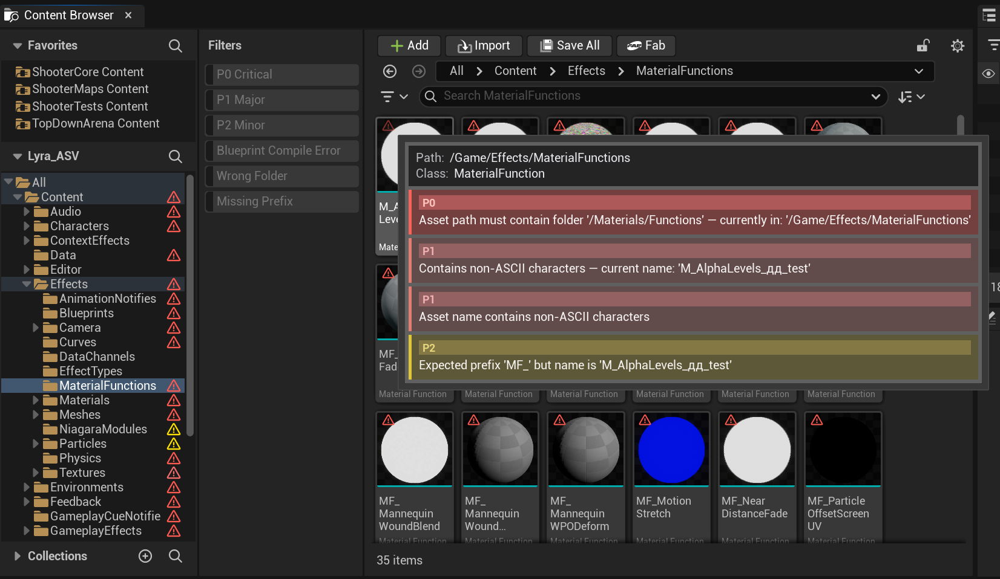
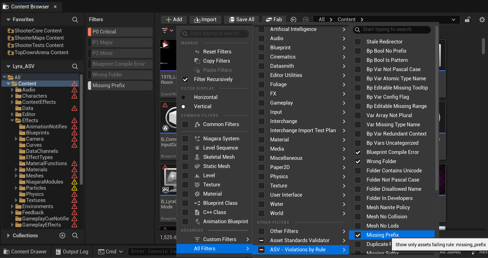
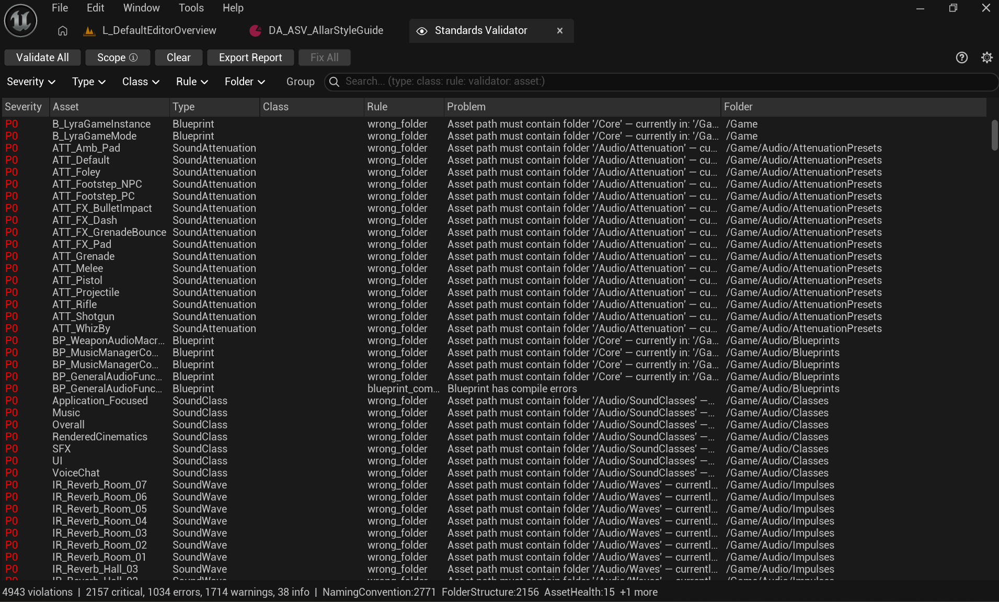
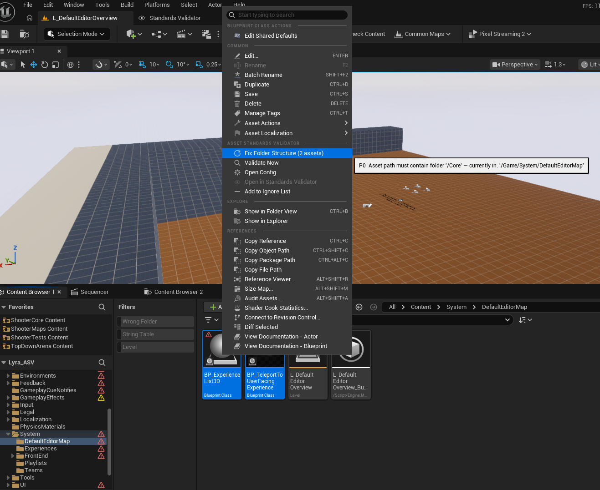
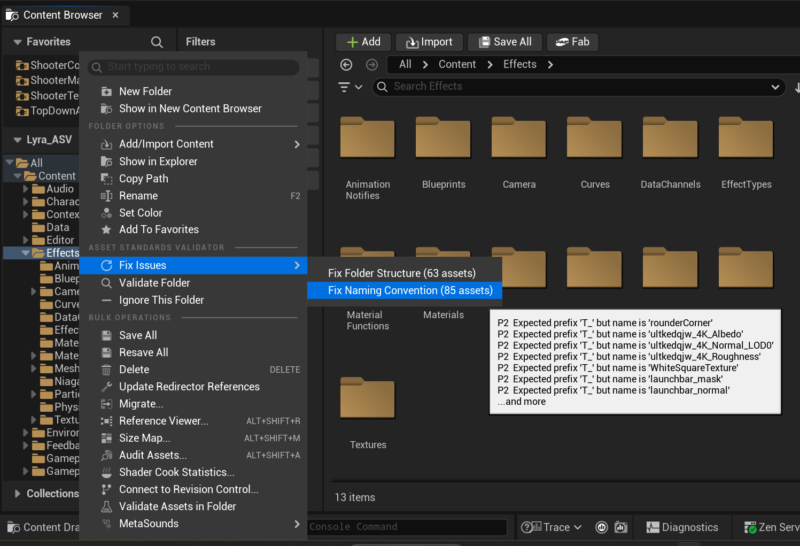
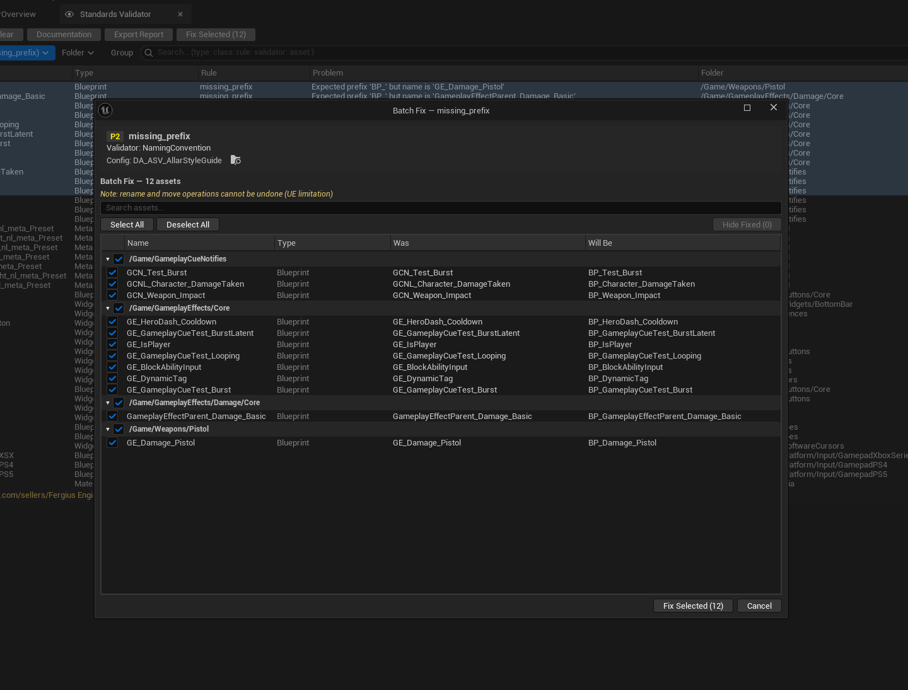
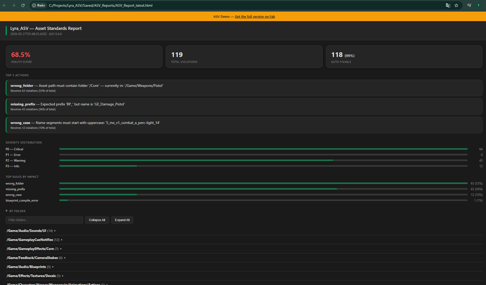
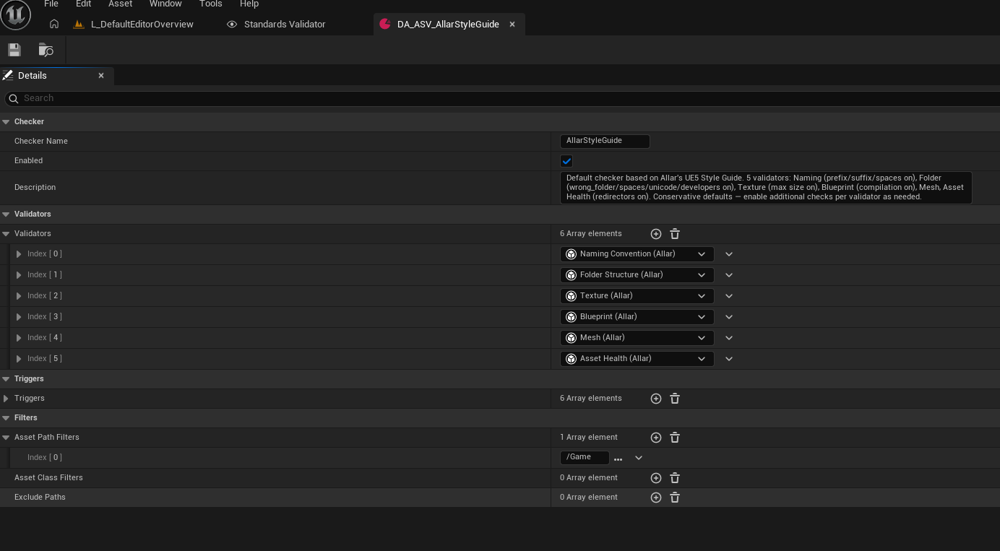
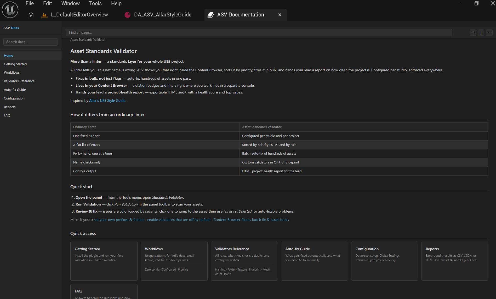

# Asset Standards Validator (Demo)

Checks UE5 assets against rules for naming, folder placement, texture settings, Blueprint variables, mesh setup and stale redirectors. What fails is marked in the Content Browser: on the asset, on the folder that holds it, and as a filter in the normal filter menu.

Fixes run in bulk. Pick a rule, look through the list of assets and proposed names, apply. After a scan the result exports to an HTML report.

Free, no time limit. The demo scans 200 assets per run and allows 5 auto-fixes per editor session. Everything else is the full plugin.

[](https://github.com/Fergius-Engineering/AssetStandardsValidatorDemo/releases)
[](https://www.fab.com/sellers/Fergius%20Engineering)
[](#install)

Downloads are on the [Releases](https://github.com/Fergius-Engineering/AssetStandardsValidatorDemo/releases) page: take `AssetStandardsValidator_Demo_{ue}_{ver}.zip` for your UE version. Install steps are [at the bottom](#install).



---

## Quick start

1. Open the **Tools** menu and click **Run Full Audit**
2. Wait for the scan. The panel opens on its own with the results in it.
3. Click **Navigate →** on a row to select that asset in the Content Browser
4. Click **Fix** on the row to apply the fix

The panel is also reachable on its own, from **Tools → Open Standards Validator** or the **Standards Validator** button in the Level Editor toolbar. Its scan button is **Validate All**.

Nothing to set up first. The plugin writes its config on first run and starts with a conservative rule set.

---

## In the Content Browser

You don't have to keep the panel open. An asset that fails a check gets a marker on its icon, and so does every folder above it, so you can see which part of the project is dirty without opening anything. Hover an asset and the tooltip lists what it failed and how bad it is.

The normal filter menu gets an **Asset Standards Validator** section. Filter by severity P0 to P3, by "Has Any Error", or by one specific rule. Two clicks and thousands of assets are down to the broken ones.

Right-click an asset for **Validate Now** and **Fix Issues**. On a folder the same menu has **Validate Folder**.





The panel is still where the full sortable list, the batch fixes and the reports live.



---

## What it checks

Six categories. Every rule works in the demo. Most of them ship switched off, because on a legacy project they return thousands of results on the first scan and nobody reads that. Turn them on as your standards settle.

| Category | Checks | Auto-fix |
|----------|--------|----------|
| **Naming Convention** | Prefix, suffix, junk names, non-ASCII | ✅ Rename |
| **Folder Structure** | Wrong location, bad path format, Developers/ check | ✅ Move |
| **Texture** | Power-of-two, max size, sRGB, compression, LOD group | ✅ Set property |
| **Blueprint** | Variable naming, bool prefix, tooltips, compilation errors | ✅ Rename var |
| **Static Mesh** | Collision, LODs, Nanite policy | ✅ Nanite only |
| **Asset Health** | Stale redirectors | ✅ Consolidate |

<details>
<summary>Full rule reference (all rule IDs, defaults, config properties)</summary>

### Naming Convention

| Rule ID | What it checks | On by default |
|---------|---------------|:-------------:|
| `missing_prefix` | Asset has required class prefix (e.g. `BP_`, `T_`) | ✅ |
| `duplicate_prefix` | Prefix is not repeated in the name | ✅ |
| `missing_suffix` | Asset has required class suffix when defined | ✅ |
| `missing_allowed_suffix` | World assets use allowed level suffixes | ✅ |
| `name_pattern_mismatch` | Name matches the allowed pattern regex | ❌ |
| `non_ascii_name` | No non-ASCII characters in name | ❌ |
| `junk_name` | Name is not a placeholder (New, Temp, Default…) | ❌ |
| `wrong_case` | Name segment starts with a lowercase letter | ❌ |

Auto-fix: `missing_prefix`, `duplicate_prefix`, `missing_suffix`, `missing_allowed_suffix`, `junk_name`, `wrong_case`.

### Folder Structure

| Rule ID | What it checks | On by default |
|---------|---------------|:-------------:|
| `wrong_folder` | Asset is in the correct folder for its class | ✅ |
| `folder_not_pascal_case` | Each folder segment uses PascalCase | ❌ |
| `folder_contains_unicode` | No non-ASCII characters in folder path | ✅ |
| `folder_disallowed_name` | No generic folder names (Assets, Meshes…) | ❌ |
| `folder_in_developers` | Asset is not inside the Developers/ folder | ✅ |

Auto-fix: `wrong_folder` (moves asset to the correct folder).

### Texture

Reads asset metadata, so the texture is not loaded in full.

| Rule ID | What it checks | On by default |
|---------|---------------|:-------------:|
| `texture_not_power_of_two` | Width and height are both powers of two | ❌ |
| `texture_exceeds_max_size` | Dimensions within max size (default 8192) | ✅ |
| `texture_wrong_srgb` | sRGB flag matches texture type | ❌ |
| `texture_wrong_compression` | Compression matches texture type | ❌ |
| `texture_wrong_group` | LOD group matches texture suffix | ❌ |

Texture type comes from the name suffix. `_D` is colour, so sRGB stays on. `_N` is a normal map, so sRGB goes off.

Auto-fix: `texture_wrong_srgb`, `texture_wrong_compression`, `texture_wrong_group`.

### Blueprint

| Rule ID | What it checks | On by default |
|---------|---------------|:-------------:|
| `bp_bool_no_prefix` | Boolean variables start with `b` | ❌ |
| `bp_bool_is_pattern` | Avoid `bIsDead` — prefer `bDead` | ❌ |
| `bp_var_not_pascal_case` | Variable uses PascalCase | ❌ |
| `bp_var_atomic_type_name` | Name does not include type (`Score` not `ScoreInt`) | ❌ |
| `bp_editable_missing_tooltip` | Editable variables have tooltip text | ❌ |
| `bp_var_config_flag` | Variable does not use the Config flag | ❌ |
| `bp_editable_missing_range` | Editable numeric variables have a range set | ❌ |
| `bp_vars_uncategorized` | Editable variables are categorized (when ≥ 5) | ❌ |
| `bp_var_redundant_context` | Variable name doesn't repeat the class name | ❌ |
| `var_array_not_plural` | Array variables use plural names | ❌ |
| `var_missing_type_name` | Struct/object variables include type name | ❌ |
| `blueprint_compile_error` | Blueprint has no compilation errors | ✅ |
| `blueprint_compile_warning` | Blueprint compiles with no warnings (deprecated nodes etc.) | ❌ |

Auto-fix: `bp_bool_no_prefix`, `bp_bool_is_pattern`, `bp_var_not_pascal_case`.

### Static Mesh

| Rule ID | What it checks | On by default |
|---------|---------------|:-------------:|
| `mesh_no_collision` | Mesh has collision geometry | ❌ |
| `mesh_no_lods` | Mesh has LODs (for meshes over 5 000 triangles) | ❌ |
| `mesh_nanite_policy` | Nanite is enabled/disabled as required | ❌ |

Auto-fix: `mesh_nanite_policy` (enables or disables Nanite per policy).

### Asset Health

| Rule ID | What it checks | On by default |
|---------|---------------|:-------------:|
| `stale_redirector` | ObjectRedirector has been resolved | ✅ |

Auto-fix: consolidates the redirector.

</details>

---

## When it runs

On first run the plugin creates a config asset at `Content/Data/DA_ASV_AllarStyleGuide`. Four of its triggers are on:

| Trigger | Fires when |
|---------|-----------|
| OnSave | an asset is saved |
| OnAssetCreated | a new asset appears |
| OnAssetRenamed | an asset is renamed |
| Manual | you press Run Full Audit, or use the right-click menu |

Two more sit in the same config switched off, because each one starts a full scan:

| Trigger | Fires when |
|---------|-----------|
| OnStartup | the editor opens |
| OnPIE | Play In Editor starts |

`PreBeginPIE` is not in the default config at all. Add it if you need level checks. It fires just before Play starts, while the editor world is still whole.

Badges update as results come in. The panel does not have to be open for any of this.



---

## Batch Fix

Fix a whole rule at once instead of clicking through rows. Narrow the panel to one rule with the **Rule** filter, then press **Fix All**. The button turns on once two or more fixable results are showing.

A dialog opens with every affected asset, grouped by folder, current name next to proposed name. Edit a proposed name in place, or uncheck a row to skip it. Collisions are caught before anything runs: two assets that would end up with the same name, or a target path that is already taken. Progress shows per row and the panel refreshes at the end.



The demo allows 5 auto-fixes per editor session. A batch run spends one of them however many assets it covers, so filtering to a whole rule and fixing it in one go is the cheap way to use them. Restarting the editor resets the count.

---

## Audit report

Press **Export Report** in the panel toolbar and pick a location. The file type dropdown in that dialog has HTML, JSON and CSV, and the demo writes HTML only.

The HTML file opens in a browser. It has a health score, the violations that cost the most, and a breakdown per folder and per rule. This is the thing to send a lead who is never going to install the plugin.



---

## Command line

The commandlet runs in both versions. In the demo it takes the 200 most recently modified assets per run. Exit codes are identical.

```
UnrealEditor-Cmd.exe MyProject.uproject -run=ASVCommandlet \
  -Root=/Game/Art,/Game/Blueprints \
  -severity=P1 \
  -format=json \
  -output=./reports/
```

Exit code 0 means clean, 1 means something failed a rule, 2 means the report could not be written. `-severity=P0` is the default and fails on critical only, `-severity=P1` counts warnings as well, and P0 to P3 are all accepted. `-Root` takes comma-separated content paths. `-MaxAssets` caps the scan.

The JSON output has per-rule counts and asset paths, which is enough to feed a CI dashboard or a PR gate.

---

## Configuration

The config DataAsset is created for you on first run: **`Content/Data/DA_ASV_AllarStyleGuide`**. Open it to switch checks on and off.



Global settings live in **Project Settings → Plugins → Asset Standards Validator**: scan roots, excluded paths, logging.

For project-specific asset types, say `GA_` for Gameplay Abilities, open the DataAsset, expand **ASVValidator_NamingConvention → Class Rules** and add an entry with the parent class and the prefix. Blueprint subclasses of that class match on their own.

The full option reference is in the in-editor docs.

---

## In-editor documentation

**Tools → Help → Documentation**. Works offline, has search, covers every validator, auto-fix, configuration and reports.



---

## Demo limits

The first scan of each editor session opens a dialog listing these.

Scans stop at 200 assets per run and take the most recently modified ones in scope. A toast tells you when the cap was applied. **Validate Now** on a single asset is not capped.

Auto-fix is limited to 5 uses per editor session. A single fix spends one; so does a whole batch run, whatever its size. Restarting the editor resets the count.

Export is HTML only. JSON and CSV need the full version, and so does writing your own validator in C++, since the demo ships without source. Demo builds are Windows only.

---

## Demo vs Full

| Feature | Demo | Full |
|---------|------|------|
| All validators | ✅ | ✅ |
| Content Browser badges + filters | ✅ | ✅ |
| Auto-fix (single asset) | ✅ | ✅ |
| Report export HTML | ✅ | ✅ |
| In-editor docs | ✅ | ✅ |
| All triggers | ✅ | ✅ |
| Batch fix | ⚠️ 5 uses/session | ✅ Unlimited |
| Batch scan | ⚠️ 200 assets/run | ✅ Unlimited |
| Report export JSON / CSV | ❌ | ✅ |
| CI commandlet | ⚠️ 200 assets/run | ✅ Unlimited |
| Custom validators (C++) | ❌ | ✅ |
| Source code | ❌ | ✅ |
| Platforms | Windows only | Windows · Linux · Mac |

---
## Install

1. Open [Releases](https://github.com/Fergius-Engineering/AssetStandardsValidatorDemo/releases) and download `AssetStandardsValidator_Demo_{ue}_{ver}.zip` for your UE version
2. Unzip it. You get a folder called `AssetStandardsValidator`.
3. Copy that folder into `UE_5.x/Engine/Plugins/Marketplace/`
4. Open your project, go to **Edit → Plugins**, find **Asset Standards Validator**, tick it and restart the editor

Builds exist for UE 5.0 through 5.8. Editor-only plugin, so it is not part of a packaged build.

---

## Full version

[Asset Standards Validator on Fab](https://www.fab.com/sellers/Fergius%20Engineering)

Unlimited scanning and fixing, JSON and CSV export, source code, and your own validators in C++. Validators are C++ only, there is no Blueprint authoring.

Remove the demo before installing it. Both builds use the same module name and the editor will not load two of them. Delete or rename the `AssetStandardsValidator` folder in `Plugins/Marketplace/`, restart, then install.

---

## Bugs and questions

[Open an issue](https://github.com/Fergius-Engineering/AssetStandardsValidatorDemo/issues) and include your UE version and what happened.

There is a [Discord](https://discord.gg/Zc7Y7nYrvz) too, if you would rather ask there.
